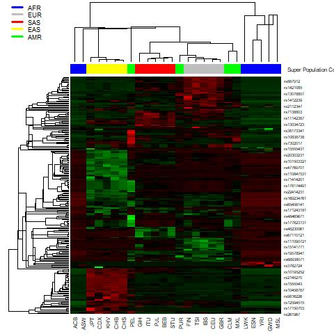

```{r setup, include=FALSE}
knitr::opts_chunk$set(cache=TRUE,
                      echo=TRUE,
                      message=FALSE,
                      warning=FALSE,
                      tidy.opts=list(width.cutoff=60),
                      tidy=TRUE,
                      fig.path='figs/',
                      cache.path = '_cache/',
                      fig.process = function(x) {
                      x2 = sub('-\\d+([.][a-z]+)$', '\\1', x)
                      if (file.rename(x, x2)) x2 else x
                      })
```

# Introduction

## Overview of the original experiment

Large research efforts have been made to identify genomic regions, variants in candidate genes, and environmental factors that contribute to disease-associated health disparities across populations.  

In a study by [Mao et al.](https://bmcgenomics.biomedcentral.com/articles/10.1186/s12864-017-4262-9#Equ1), worldwide differences in the effect allele frequency of 225 obesity-associated SNPs were investigated. The original analysis was conducted to identify significantly enriched or depleted effect alleles across 26 populations, which were later interrogated with respect to the relevance and underlying biological mechanisms of their associated genes. Additionally, researchers inspected the population-based patterns that emerged from differences in allele frequency and genetic risk scores. The results suggest that over 85% of effect alleles exhibit significant allele frequency differences and that population-level differences in genetic risk scores are correlated with obesity prevalence.  

## Goals of the re-analysis

In Genome-Wide Association Studies (GWAS), the over-representation of European populations is frequently coupled with inadequate sampling of African genomes in SNP arrays and imputation reference panels. As a result, ascertainment bias commonly confounds the associations between genetic ancestry and disease susceptibility.  

The main goal of this re-analysis is to explore obesity-related variants among a subset of samples, namely those associated with the African American (ASW), African (YRI), and European American (CEU) populations. As such, this project will interrogate the relationship between disease susceptibility, ancestry, and admixture to elucidate the genetic underpinnings of health disparities across populations. Furthermore, this re-analysis will evaluate the transferability of GWA studies by considering the ancestral diversity within and between study cohorts.  

Ultimately, this re-analysis will illustrate the spectrum of genetic diversity between geographically distant genomes to reveal ancestral biological signatures and systematic differences underlying the obesity epidemic. In doing so, we hope to encourage diversity and inclusion in genomics research, as well as urge for the investigation of genetic variants with extreme allele frequency differences (EAFD) between populations.  

# Methods

This project implements a pipeline that uses the R programming language to automate key components of data processing, analysis, and visualisation. It consists of a re-analysis of the original study using a reduced scope, where only 3 out of the 26 populations are investigated with much greater depth.

```{r}
# install any of these that you might not have already
library(knitr)
library(readxl)
library(reshape2)
library(ggplot2)
library(dplyr)
library(tidyr)
library(ggvenn)
library(RColorBrewer)
library(heatmap3)
```

## Overview of the pipeline stages

### Data download

For the first stage of the pipeline, we obtained a list of obesity-associated SNPs and their effect allele frequencies from the supplementary material available in the original publication.  The authors compiled 225 SNPs from 29 GWA studies in the NHGRI-EBI GWAS Catalog, 19 of which were performed in European populations, 3 in East Asians, 2 in South Asians, 3 in Africans, and 2 in mixed ethnic populations. The corresponding effect allele frequencies were based on genotype information for 26 populations surveyed by the 1000 Genomes Project.  

```{bash, eval = TRUE, engine.opts='-l'}

wget -q https://static-content.springer.com/esm/art%3A10.1186%2Fs12864-017-4262-9/MediaObjects/12864_2017_4262_MOESM1_ESM.xlsx

```

In doing so, we overcame computationally-intensive and resource-demanding challenges associated with retrieving data from the 1000 Genomes Project. At the same time, we ensured that this re-analysis was conducted on the raw data set used by the original publication prior to any filtering or manipulation steps.     

### Data pre-processing

The next stage involved selecting a subset of the data from the original publication. To compare the association signals of each variant as they relate to admixture, we chose to investigate the American (ASW), African (YRI), and European American (CEU) populations.  

A helper function was created to assist in generating and populating data frames with the raw downloaded data, as outlined below.  

```{r, eval = TRUE}
# function: "populateDfs": a function to populate data frames with user-specified population data from the original study
# argument(s): "input": the table from the original publication
#              "list": a vector of population codes to be investigated in the re-analysis, as per 1000 Genomes convention
#              "rows": a vector of row names (i.e., SNP IDs)
#              "cols": a vector of column names (i.e., SNP information)               
# return value(s): "popInfo": a data frame of population-specific effect allele frequency data
#                  "backgroundInfo": a data frame of global population SNP data, which consists of all user-specified populations pulled together 
#                  "XINfo": n data frames of population-specific SNP data, whcih consists of the breakdown of "backgroundInfo" into the distinct populations

populateDfs <- function(input,list,rows,cols){ 
  popInfo <- data.frame(row.names=rows)
  backgroundInfo <- data.frame(matrix(nrow=length(rows),ncol=length(cols)))
  
  colnames(backgroundInfo) <- cols
  backgroundInfo$population <- "ALL"
  backgroundInfo$`GWAS P-value` <- data$`GWAS P-value`
  backgroundInfo[is.na(backgroundInfo)] <- 0

  for(i in seq(from=4, to=ncol(input), by=5)){
    population <- toString(input[1,i])
    if(population %in% list){
      popInfo[population] <- input[,i+4]
      assign(paste(population,"Info",sep=""), input[,i:(i+4)], envir = .GlobalEnv)
      backgroundInfo["effect allele number"] <- as.numeric(backgroundInfo[["effect allele number"]]) + as.numeric(input[["effect allele number"]])
      backgroundInfo["other allele number"] <- as.numeric(backgroundInfo[["other allele number"]]) + as.numeric(input[["other allele number"]])
      backgroundInfo["total allele number"] <- as.numeric(backgroundInfo[["total allele number"]]) + as.numeric(input[["total allele number"]])
      backgroundInfo["effect allele frequency"] <- as.numeric(backgroundInfo[["effect allele frequency"]]) + as.numeric(input[["effect allele frequency"]])
    }
  }
  
  return(list(popInfo,backgroundInfo))
  
}

```

### Data analysis

The bulk of this re-analysis consisted of two main interrogations, namely the investigation of significant enrichment or depletion patterns and of extreme allele frequency differences.

For the first portion, we conducted hypergeometric tests to assess if the effect allele of each SNP was enriched or depleted in the 3 populations as compared to the overall population average. The results of these tests were the foundation for many subsequent steps, including the production of Venn diagrams, heat maps, and tabulated data. For the second portion, we utilized the allele frequency data from the original publication to plot the distribution of effect allele frequency across the three populations.

#### Quality control and filtering

As mentioned previously, the inputs of this re-analysis are essentially raw. Thus, we applied a series of processing steps for both statistical and visualization purposes.  

The first filtering step consisted of selecting a subset of the 3 populations out of the original 26, as described in the section above. As a caveat, the original publication included a 27th "population"," which pulls all 26 populations together and is referred to as the **global population** for hypothesis testing purposes. Thus, a "4th" population was similarly created for this smaller data set consisting of the ASW, YRI, and CEU groups.  

Then, we conducted two separate hypergeometric tests for each of the 225 SNPs, one for enrichment and one for depletion. This yielded 6 (2 x 3) tests per SNP, for a total of 1350 (6 x 225) tests across all 225 SNPs and 3 populations. With an overall significance level of 0.01, we applied Bonferroni correction to control the family-wise error rate (FWER) at a raw p-value cutoff of 7.4E-06 (0.01/1350). This first data set was used to produce the Venn diagrams and heat maps pertaining to the enrichment analysis.   

For further inspection of a smaller subset of SNPs from the original 225 obesity-related variants, we selected those with enrichment or depletion log10 transformed p-values of at least 10E-100 and genome-wide significance (5 × 10E-08) in GWA studies. This second data set was used to produce the risk (effect) allele frequency distribution plots.  

Once again, a set of helper functions were created to aid in data wrangling and hypothesis testing.  

```{r, eval=TRUE}
# function: "hyperTest": a function to perform the enrichment analysis using Fisher’s two-tail exact test (two hypergeometric tests, one for enrichment and another for depletion, are conducted per SNP)
# argument(s): "list": a vector of population codes to be investigated in the re-analysis, as per 1000 Genomes convention
#              "background": a data frame of global population SNP data, which consists of all user-specified populations pulled together 
# return value(s): "enrichmentDf": a data frame containing the results of the enrichment analysis
#                  "depletionDf": a data frame containing the results of the depletion analysis

hyperTest <- function(list,background){
  enrichmentDf <- data.frame()
  depletionDf <- data.frame()
  
  popDfs <- paste(list,"Info",sep="")
  
  for(i in 1:nrow(background)){
    a <- c()
    b <- c()
    for (df in popDfs){
      info <- get(df)
      m <- as.numeric(background$`effect allele number`[i]) # total number of effect alleles in the population
      n <- as.numeric(background$`other allele number`[i]) # total number of other alleles in the population
      k <- as.numeric(info$`total allele number`[i]) # total number of alleles (effect + other) in the sample
      q <- as.numeric(info$`effect allele number`[i]) # number of effect alleles selected from the sample
      
      # phyper(q,m,n,k) = phyper(success-in-sample, success-in-bkgd, failure-in-bkgd, sample-size)
      a <- cbind(a,phyper(q=q-1,m=m,n=n,k=k,lower.tail=FALSE)) # over-representation (enrichment)
      b <- cbind(b,phyper(q=q,m=m,n=n,k=k,lower.tail=TRUE)) # under-representation (depletion)
    }
    enrichmentDf <- rbind(enrichmentDf,a)
    depletionDf <- rbind(depletionDf,b)
  }
  return(list(enrichmentDf,depletionDf))
}

# function: "renameColsRows": a function to re-name data frames, modifying rows to SNP IDs columns to population IDs 
# argument(s): "dfs": a list of data frames (as strings) to be modified
#              "rows": a vector of row names (i.e., SNP IDs)
#              "list": a vector of population codes to be investigated in the re-analysis, as per 1000 Genomes convention
# return value(s): NA (modifies the data frames in the global environment)
renameColsRows <- function(dfs,rows,list){
  for(df in dfs) {
    df.tmp <- data.frame(get(df))
    colnames(df.tmp) <- list
    rownames(df.tmp) <- rows
    assign(df, df.tmp, envir = .GlobalEnv)
  }
}

# function: "combineHyper": a function to combine two data frames, namely the ones produced by hyperTest (enrichment and depletion)
# argument(s): "dfs": a list of data frames (as strings) to be modified
#              "rows": a vector of row names (i.e., SNP IDs)
# return value(s): hyperRes": a data frame holding the combined results of the enrichment/depletion analysis

combineHyper <- function(dfs,rows){
  hyperRes <- data.frame()
  for(df in dfs) {
    df.tmp <- get(df)
    df.tmp$type <- sub("Df","",df)
    df.tmp$`GWAS P-value` <- as.numeric(data$`GWAS P-value`[match(rownames(df.tmp),rows)])
    assign(df, df.tmp)
    hyperRes <- rbind(hyperRes,df.tmp)
  }
  return(hyperRes)
  
}

```

### Data visualization

In this re-analysis, many hypothesis can be made based on the graphical depiction of data. Thus, we created different plots to assist in drawing conclusions about ancestry and admixture as they relate to obesity prevalence. The helper functions are described below.  

For clustering, we used the centroid option as the linkage method and correlation-based distance to compute the dissimilarity matrix. These choices are common in gene expression analysis, where clusters of observations are formed based on overall profiles rather than magnitudes (e.g., similar genes are “up” and “down” together, regardless of their absolute expression value). The choice of Sperman's correlation instead of Pearson’s correlation was done to mitigate the possible impact of outliers.


```{r,eval=TRUE}
# function: "makeVenn": a function to create a Venn diagram that illustrates the differences and similarities between the populations under investigation
# argument(s): "df": a data frame of p-values (either enrichment or depletion)
#              "list": a vector of population codes to be investigated in the re-analysis, as per 1000 Genomes convention
#              "sig": the significance level (alpha)
# return value(s): "plot": a Venn diagram
makeVenn <- function(df,list,sig){
  cutoff <- sig / (2*length(list)*nrow(df)) # control the family-wise error rate (FWER) from MHT using Bonferroni correction
  
  filteredDf <- data.frame(df < cutoff)
  table <- table(rowSums(filteredDf))
  plot <- ggvenn(filteredDf)
  return(plot)
}

# function: "getSig": a function to filter the output of the enrichment/depletion analysis for significant results
# argument(s): "df": a data frame of p-values (either enrichment or depletion)
#              "list": a vector of population codes to be investigated in the re-analysis, as per 1000 Genomes convention
#              "sig": the significance level (alpha)
# return value(s): "logDf": a data frame with the log10 transformed p-values of significantly enriched and depleted effect alleles
getSig <- function(df,list,sig){
  cutoff <- sig / (2*length(list)*nrow(df))
  
  meltedDf <- melt(df,id.vars=c(list,"type","GWAS P-value"))
  sigDf <- meltedDf[!rowSums(meltedDf[,1:(ncol(meltedDf)-2)] < cutoff)==0,,drop=FALSE] # remove rows whose raw p-value is not significant at alpha 
  logDf <- sigDf %>% mutate_at(1:(ncol(sigDf)-2), log10) # log10 transform p-values
  return(logDf)
}

# function: "makeHeatmap": a function to create a heat map that illustrates the enrichment/depletion of significant SNPs across the populations under investigation
# argument(s): "df": a data frame with the log10 transformed p-values of significantly enriched and depleted effect alleles
# return value(s): NA (saves the heat map as a .jpeg file to the current directory)
makeHeatmap <- function(df){
  heatmapDf <- df
  heatmapDf[heatmapDf$type == "enr",] <- heatmapDf[heatmapDf$type == "enr",] %>% mutate_at(1:(ncol(heatmapDf)-2), ~ . * -1)
  # the negative of log10 of the p-value (a positive number) is used to represent enriched effect allele of a SNP for a population in the heatmap
  # the actual value of log10 of the p-value (a negative number) is used to represent depleted effect allele of a SNP for a population in the heatmap
  
  heatmapMtx <- as.matrix(heatmapDf[ , 1:(ncol(heatmapDf)-2)]) # create a matrix from the FWER filtered, combined, log-transformed, and additive inverse-corrected p-values
  heatmapMtx[!is.finite(heatmapMtx)] <- 0
  rm <- apply(heatmapMtx, 1, var) == 0
  y <- heatmapMtx[!rm,]
  hr <- hclust(as.dist(1-cor(t(y), method = "spearman")), method = "centroid")
  hc <- hclust(as.dist(1-cor(y, method = "spearman")), method = "centroid")
  col_fun = colorRampPalette(c("green", "black", "red"))(1024)
  jpeg(file="heatmap.jpg")
  heatmap3(y, Rowv = as.dendrogram(hr), Colv = as.dendrogram(hc), col=col_fun,scale="row",file="heatmap.pdf")
  dev.off()
}
  
# function: "plotDist": a function to plot the distribution of effect allele frequencies for select SNPs
# argument(s): "df": a data frame with the log10 transformed p-values of significantly enriched and depleted effect alleles
#              "frequency": a data frame containing the effect allele frequencies for the select populations
# return value(s): "plot": a distribution frequency plot
plotDist <- function(df,frequency){
  freqDf <- df[!rowSums(abs(df[,1:(ncol(df)-2)]) < 10E-100)==0,,drop=FALSE] # remove rows whose log10 transformed p-value is not significant at 10E-100
  freqDf <- freqDf[freqDf$`GWAS P-value` < 5E-08,]  # remove rows whose SNPs has not reached genome-wide significance (5 × 10−8) in GWA studies
  filteredSNP <- rownames(freqDf)
  
  frequency["id"] <- rownames(frequency)
  meltedPopDf <- melt(frequency, id.vars="id", value.name="MAF", variable.name="Population")
  filteredPopDf <- meltedPopDf[meltedPopDf$id %in% filteredSNP ,]
  plot <- ggplot(filteredPopDf,aes(x=id,y=MAF,fill=Population)) + geom_dotplot(binaxis='y', stackdir='center')
  return(plot)
}

```

## Results

```{r, eval=TRUE, message=FALSE}

data <- read_excel("12864_2017_4262_MOESM1_ESM.xlsx") # read the data from the original publication
colnames(data) <- data[2, ] # the second row is now the header
data <- data[-c(1,2), ] # and the first two rows can be removed

varInfo <- data[,1:3] # gather general SNP data (SNP ID, effect allele, other allele)

rowData <- data$`SNP ID`
colData <- c("population","effect allele number","other allele number",
             "total allele number","effect allele frequency")

myPop <- c("CEU","ASW","YRI") # make a list of the populations under investigation

otherInfo <- populateDfs(data,myPop,rowData,colData)
freqInfo <- otherInfo[[1]] # gather effect allele frequency data for the select populations
bckgdInfo <- otherInfo[[2]] # gather general SNP data for the global average of select populations

hyperRes <- hyperTest(myPop,bckgdInfo)
enrDf <- hyperRes[[1]] # gather enrichment analysis results for the 225 SNPs and 3 populations
depDf <- hyperRes[[2]] # gather depletion analysis results for the 225 SNPs and 3 populations

renameColsRows(c("enrDf","depDf"),rowData,myPop)
hyperComb <- combineHyper(c("enrDf","depDf"),rowData)
sigRes <- getSig(hyperComb,myPop,0.01)

```

````{r, eval=TRUE, tidy = TRUE, cache=FALSE, fig.cap="A Venn diagram of significantly enriched effect alleles", message=F, warning=F}
enrVenn <- makeVenn(enrDf,myPop,0.01)
enrVenn

```

````{r, eval=TRUE, tidy = TRUE, cache=FALSE, fig.cap="A Venn diagram of significantly depleted effect alleles", message=F, warning=F}
depVenn <- makeVenn(depDf,myPop,0.01)
depVenn

```

``````{r pressure, echo=FALSE, fig.cap="A heat map of sginificantly enriched and depleted effect alleles", out.width = '100%'}

makeHeatmap(sigRes)



```


````{r, eval=TRUE, tidy = TRUE, cache=FALSE, fig.cap="A plot of the distribution of effect allele frequencies for the most significant SNPs", message=F, warning=F}
distPlot <- plotDist(sigRes,freqInfo)

```

For better validation of the reproducibility of this re-analysis, we also generated a heat map of the enrichment/depletion p-values (log10 based) of effect alleles in all 26 populations. The use of a pipeline for most aspects of the project greatly facilitated this step, as the only parameter to be modified was the populations under investigation.  

```{r, eval = FALSE}

# function: "getPops": a function to retrieve the names of all surveyed populations (26)
# argument(s): "input": the table from the original publication
# return value(s): "list": a vector of population codes reported in the study, as per 1000 Genomes convention

getPops <- function(input){
  list <- c()
  for(i in seq(from=4, to=ncol(input), by=5)){
    population <- toString(input[1,i])
    list <- append(list,population)
  }
  return(list)
}

allPop <- getPops(data) # make a list of all 26 populations included in the study

```


# Conclusions