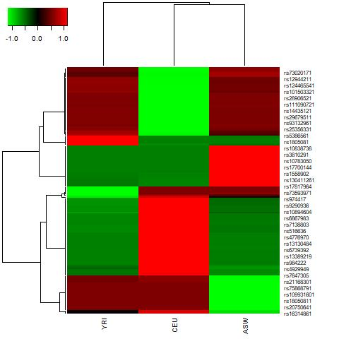
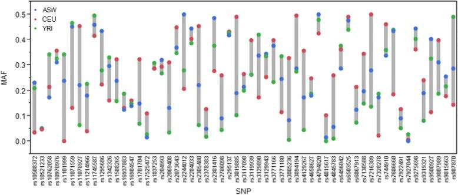
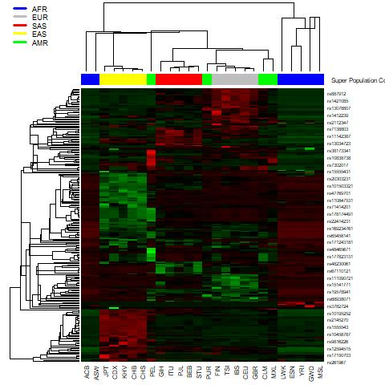
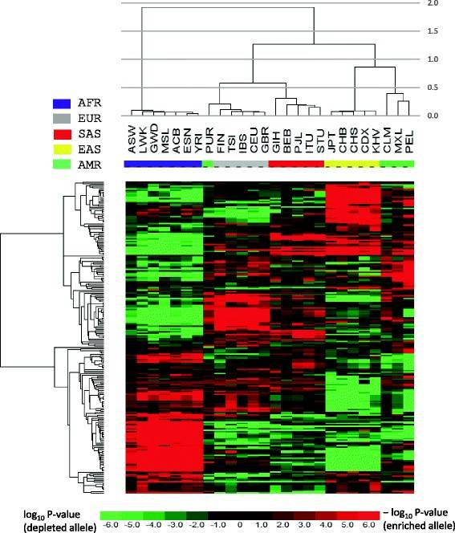

```{r setup, include=FALSE}
knitr::opts_chunk$set(cache=TRUE,
                      echo=TRUE,
                      message=FALSE,
                      warning=FALSE,
                      tidy.opts=list(width.cutoff=60),
                      tidy=TRUE,
                      fig.pos = "H",
                      fig.path='figs/',
                      cache.path = '_cache/',
                      fig.process = function(x) {
                      x2 = sub('-\\d+([.][a-z]+)$', '\\1', x)
                      if (file.rename(x, x2)) x2 else x
                      })
```

# Introduction

## Overview of the original experiment

Large research efforts have been made to identify genomic regions, variants in candidate genes, and environmental factors that contribute to disease-associated health disparities across populations.

In a study by [Mao et al.](https://bmcgenomics.biomedcentral.com/articles/10.1186/s12864-017-4262-9#Equ1), worldwide differences in the effect allele frequency of 225 obesity-associated SNPs were investigated. The original analysis was conducted to identify significantly enriched or depleted effect alleles across 26 populations, which were later interrogated with respect to the clustering patterns that emerged within and between different continental groups. Additionally, researchers calculated the composite risk scores for each population. Their results suggest that over 85% of effect alleles exhibit significant allele frequency differences and that population-level differences in genetic risk scores are correlated with obesity prevalence.


```{r, echo=FALSE}
x <- tempfile()
download.file("apps.who.int/gho/athena/api/GHO/NCD_BMI_30A.csv?filter=COUNTRY:*","WHO_BMI", mode = 'wb' )
WHO_BMI <- read.csv('WHO_BMI')
# removing NAs (missing values)
WHO_BMI <- WHO_BMI[complete.cases(WHO_BMI), ]

# parameters to filter
sex <- c("BTSX")
year <- c("2010")
EU_USA_countries <-c("ITA", "ESP", "FIN", "USA", "GBR")
ASN_countries <- c("JPN", "KOR", "VNM", "CHN")
countries <- c("ITA", "ESP", "FIN", "USA", "GBR", "JPN", "KOR", "VNM", "CHN")

# filtering by parameters
filtWHO_BMI <- WHO_BMI[WHO_BMI$COUNTRY %in% countries ,]
filtWHO_BMI <- filtWHO_BMI[filtWHO_BMI$SEX %in% sex ,]
filtWHO_BMI <- filtWHO_BMI[filtWHO_BMI$YEAR %in% year ,]


# plotting bar chart
plot_WHO <- ggplot(filtWHO_BMI, aes(x=reorder(factor(COUNTRY),Numeric), y=Numeric)) +
  geom_bar(stat='identity') +
  coord_flip() +
  xlab("Country") +
  ylab("Obesity prevalence %") +
  ggtitle("Obesity prevalence by country")

plot_WHO
```

```{r, echo=FALSE}

regions <- c("AFR", "EUR")
sex <- c("BTSX")
year <- c("2010","2011","2012","2013","2014","2015","2016")
filtregWHO_BMI <- WHO_BMI[WHO_BMI$REGION %in% regions ,]
filtregWHO_BMI <- filtregWHO_BMI[filtregWHO_BMI$SEX %in% sex ,]
filtregWHO_BMI <- filtregWHO_BMI[filtregWHO_BMI$YEAR %in% year ,]


plot_vis <- ggplot(filtregWHO_BMI, aes(x=YEAR)) + 
  geom_point(aes(y=Numeric, col=REGION)) + 
  labs(title="Time Series of BMI distributions per year ",
       caption="Source: Economics", 
       y="Obesity prevelence %", 
       color=NULL) +  # title and caption
  scale_color_manual(labels = c("AFR", "EUR"), 
                     values = c("AFR"="#00ba38", "EUR"="#f8766d")) +  # line color
  theme(axis.text.x = element_text(angle = 90, vjust=0.5, size = 8),  # rotate x axis text
        panel.grid.minor = element_blank())
plot_vis
```
## Goals and scope of the re-analysis

The original publication concluded that populations belonging to the same continental group showcased similar patterns in allele enrichment and depletion, suggesting that continent-specific environmental factors may shape the allele abundance of obesity-associated SNPs. In this re-analysis, however, we focus on the role of genetic factors, particularly ancestry-enrichment, by investigating admixed populations from geographically distant regions.

For these purposes, we reduced the scope to a subset of samples, namely the African American (ASW), African (YRI), and European American (CEU) populations. The main goal of this project is to interrogate the relationship between obesity-related variants and ancestry and elucidate the genetic underpinnings of disease susceptibility across populations.

Ultimately, this re-analysis will illustrate the spectrum of genetic diversity between geographically distant genomes to reveal ancestral biological signatures and systematic differences underlying the obesity epidemic. In doing so, we hope to encourage diversity and inclusion in genomics research, as well as urge for the investigation of genetic variants with extreme allele frequency differences (EAFD) between populations to help address health disparities.

# Methods

This project implements a pipeline that uses the R programming language to automate key components of data processing, analysis, and visualization. Furthermore, it utilizes a wide set of user-defined helper functions that are documented and showcased in the Appendix.

It consists of a re-analysis of the original study, where only 3 out of the 26 populations are investigated to explore the impact of ancestral genetics rather than environmental factors on obesity prevalence.

```{r, include=FALSE}
# install any of these that you might not have already
library(knitr)
library(readxl)
library(reshape2)
library(ggplot2)
library(dplyr)
library(tidyr)
library(ggvenn)
library(RColorBrewer)
library(heatmap3)
library(data.table)
library(jpeg)
library(here)
```

## Overview of the pipeline stages

### Data download

For the first stage of the pipeline, we obtained a list of obesity-associated SNPs and their effect allele frequencies from the supplementary material available in the original publication. The authors compiled 225 SNPs from 29 GWA studies in the NHGRI-EBI GWAS Catalog, 19 of which were performed in European populations, 3 in East Asians, 2 in South Asians, 3 in Africans, and 2 in mixed ethnic populations. The corresponding effect allele frequencies were based on genotype information for 26 populations surveyed by the 1000 Genomes Project.

By utilizing pre-compiled, but not pre-processed data, we overcame computationally-intensive and resource-demanding challenges associated with retrieving data from the 1000 Genomes Project. At the same time, we ensured that this re-analysis was conducted on the raw data set used by the original publication prior to any major filtering or manipulation steps.

As a caveat, data for the calculation of composite risk scores was not published in the original study. The formula used by the authors required information about the 225 SNPs for each person present in the 1000 Genomes Project, including the number of copies of effect alleles at obesity-associated variants and their effect size. Since these could not be retrieved for the reasons mentioned above, we performed two additional analyses on the enrichment and depletion data. An investigation of Venn diagrams and allele frequency distribution plots were thus added to make up for this lacking step in the re-analysis.

```{bash, eval = TRUE, engine.opts='-l',include=FALSE}

wget -q https://static-content.springer.com/esm/art%3A10.1186%2Fs12864-017-4262-9/MediaObjects/12864_2017_4262_MOESM1_ESM.xlsx

```

### Data pre-processing

The next stage involved selecting a subset of the data from the original publication. To compare the association signals of each variant as they relate to admixture, we chose to investigate the African American (ASW), African (YRI), and European American (CEU) populations.

The helper function created to assist in generating and populating data frames with the raw downloaded data is described in [Appendix A: populateDfs](#appendix-a-populatedfs).

```{r, eval = TRUE, echo=FALSE}
# function: "populateDfs": a function to populate data frames with user-specified population data from the original study
# argument(s): "input": the table from the original publication
#              "list": a vector of population codes to be investigated in the re-analysis, as per 1000 Genomes convention
#              "rows": a vector of row names (i.e., SNP IDs)
#              "cols": a vector of column names (i.e., SNP information)               
# return value(s): "popInfo": a data frame of population-specific effect allele frequency data
#                  "backgroundInfo": a data frame of global population SNP data, which consists of all user-specified populations pulled together 
#                  "XINfo": n data frames of population-specific SNP data, whcih consists of the breakdown of "backgroundInfo" into the distinct populations

populateDfs <- function(input,list,rows,cols){ 
  popInfo <- data.frame(row.names=rows)
  backgroundInfo <- data.frame(matrix(nrow=length(rows),ncol=length(cols)))
  
  colnames(backgroundInfo) <- cols
  backgroundInfo$population <- "ALL"
  backgroundInfo$`GWAS P-value` <- input$`GWAS P-value`
  backgroundInfo[is.na(backgroundInfo)] <- 0

  for(i in seq(from=4, to=ncol(input), by=5)){
    population <- toString(input[1,i])
    if(population %in% list){
      popInfo[population] <- input[,i+4]
      assign(paste(population,"Info",sep=""), input[,i:(i+4)], envir = .GlobalEnv)
      backgroundInfo["effect allele number"] <- as.numeric(backgroundInfo[["effect allele number"]]) + as.numeric(input[["effect allele number"]])
      backgroundInfo["other allele number"] <- as.numeric(backgroundInfo[["other allele number"]]) + as.numeric(input[["other allele number"]])
      backgroundInfo["total allele number"] <- as.numeric(backgroundInfo[["total allele number"]]) + as.numeric(input[["total allele number"]])
      backgroundInfo["effect allele frequency"] <- as.numeric(backgroundInfo[["effect allele frequency"]]) + as.numeric(input[["effect allele frequency"]])
    }
  }
  
  return(list(popInfo,backgroundInfo))
  
}

```

### Data analysis

The bulk of this re-analysis consisted of two main interrogations, namely the investigation of significant enrichment or depletion patterns and of extreme allele frequency differences.

For the first portion, we conducted hypergeometric tests to assess if the effect allele of each SNP was enriched or depleted in the 3 populations as compared to the overall population average. The results of these tests were the foundation for many subsequent steps, including the production of Venn diagrams, heat maps, and tabulated data. For the second portion, we utilized the allele frequency data from the original publication to plot the distribution of effect allele frequency across the three populations.

### *Quality control and filtering*

As mentioned previously, the inputs of this re-analysis are essentially raw. Thus, we applied a series of processing steps for both statistical and visualization purposes.

The first filtering step consisted of selecting a subset of the 3 populations out of the original 26, as alluded to in the section above. As a caveat, the original publication included a 27th "population"," which pulls all 26 populations together and is referred to as the **global population** for hypothesis testing purposes. Thus, a "4th" population was similarly created for this smaller data set consisting of the ASW, YRI, and CEU groups.

Then, we conducted two separate hypergeometric tests for each of the 225 SNPs, one for enrichment and one for depletion. This yielded 6 (2 x 3) tests per SNP, for a total of 1350 (6 x 225) tests across all 225 SNPs and 3 populations. With an overall significance level of 0.01, we applied Bonferroni correction to control the family-wise error rate (FWER) at a raw p-value cutoff of 7.4E-06 (0.01/1350). This first data set was used to produce the Venn diagrams and heat maps pertaining to the enrichment analysis.

For further inspection of a smaller subset of SNPs from the original 225 obesity-related variants, we replicated the orinal methods and selected those with enrichment or depletion log10 transformed p-values of at least 10E-100 and genome-wide significance (5 × 10E-08) in GWA studies. This second data set was used to produce the risk (effect) allele frequency distribution plots.

Once again, a set of helper functions were created to aid in data wrangling and hypothesis testing. These are available in [Appendix B: hyperTest, renameColsRows, and combineHyper](#appendix-b-hypertest-renamecolsrows-combinehyper). 

```{r, eval=TRUE,echo=FALSE}
# function: "hyperTest": a function to perform the enrichment analysis using Fisher’s two-tail exact test (two hypergeometric tests, one for enrichment and another for depletion, are conducted per SNP)
# argument(s): "list": a vector of population codes to be investigated in the re-analysis, as per 1000 Genomes convention
#              "background": a data frame of global population SNP data, which consists of all user-specified populations pulled together 
# return value(s): "enrichmentDf": a data frame containing the results of the enrichment analysis
#                  "depletionDf": a data frame containing the results of the depletion analysis

hyperTest <- function(list,background){
  enrichmentDf <- data.frame()
  depletionDf <- data.frame()
  
  popDfs <- paste(list,"Info",sep="")
  
  for(i in 1:nrow(background)){
    a <- c()
    b <- c()
    for (df in popDfs){
      info <- get(df)
      m <- as.numeric(background$`effect allele number`[i]) # total number of effect alleles in the population
      n <- as.numeric(background$`other allele number`[i]) # total number of other alleles in the population
      k <- as.numeric(info$`total allele number`[i]) # total number of alleles (effect + other) in the sample
      q <- as.numeric(info$`effect allele number`[i]) # number of effect alleles selected from the sample
      
      # phyper(q,m,n,k) = phyper(success-in-sample, success-in-bkgd, failure-in-bkgd, sample-size)
      a <- cbind(a,phyper(q=q-1,m=m,n=n,k=k,lower.tail=FALSE)) # over-representation (enrichment)
      b <- cbind(b,phyper(q=q,m=m,n=n,k=k,lower.tail=TRUE)) # under-representation (depletion)
    }
    enrichmentDf <- rbind(enrichmentDf,a)
    depletionDf <- rbind(depletionDf,b)
  }
  return(list(enrichmentDf,depletionDf))
}

# function: "renameColsRows": a function to re-name data frames, modifying rows to SNP IDs columns to population IDs 
# argument(s): "dfs": a list of data frames (as strings) to be modified
#              "rows": a vector of row names (i.e., SNP IDs)
#              "list": a vector of population codes to be investigated in the re-analysis, as per 1000 Genomes convention
# return value(s): NA (modifies the data frames in the global environment)
renameColsRows <- function(dfs,rows,list){
  for(df in dfs) {
    df.tmp <- data.frame(get(df))
    colnames(df.tmp) <- list
    rownames(df.tmp) <- rows
    assign(df, df.tmp, envir = .GlobalEnv)
  }
}

# function: "combineHyper": a function to combine two data frames, namely the ones produced by hyperTest (enrichment and depletion)
# argument(s): "dfs": a list of data frames (as strings) to be modified
#              "rows": a vector of row names (i.e., SNP IDs)
# return value(s): hyperRes": a data frame holding the combined results of the enrichment/depletion analysis

combineHyper <- function(dfs,rows){
  hyperRes <- data.frame()
  for(df in dfs) {
    df.tmp <- get(df)
    df.tmp$type <- sub("Df","",df)
    df.tmp$`GWAS P-value` <- as.numeric(data$`GWAS P-value`[match(rownames(df.tmp),rows)])
    assign(df, df.tmp)
    hyperRes <- rbind(hyperRes,df.tmp)
  }
  return(hyperRes)
  
}

```

### Data visualization

In this re-analysis, many hypothesis can be made based on the graphical depiction of data. Thus, we created different plots to assist in drawing conclusions about ancestry and admixture as they relate to obesity prevalence. The helper functions are available in [Appendix C: makeVenn, makeHeatmap, and plotDist](#appendix-c-makevenn-makeheatmap-plotdist).

For clustering, we used the centroid option as the linkage method and correlation-based distance to compute the dissimilarity matrix. These choices are common in gene expression analysis, where clusters of observations are formed based on overall profiles rather than magnitudes (e.g., similar genes are "up" and "down" together, regardless of their absolute expression value). Furthermore, they were made to reproduce the clustering algorithm employed by the tool used in the original study, [dChip](https://sites.google.com/site/dchipsoft/home).

It defines the distance between two genes is as *1-r*, where *r* is the Pearson correlation coefficient between the standardized expression values (make mean 0 and standard deviation 1) of the two genes across the samples used.

```{r,eval=TRUE,echo=FALSE}
# function: "makeVenn": a function to create a Venn diagram that illustrates the differences and similarities between the populations under investigation
# argument(s): "df": a data frame of p-values (either enrichment or depletion)
#              "list": a vector of population codes to be investigated in the re-analysis, as per 1000 Genomes convention
#              "sig": the significance level (alpha)
# return value(s): "plot": a Venn diagram
makeVenn <- function(df,list,sig){
  cutoff <- sig / (2*length(list)*nrow(df)) # control the family-wise error rate (FWER) from MHT using Bonferroni correction
  
  filteredDf <- data.frame(df < cutoff)
  table <- table(rowSums(filteredDf))
  plot <- ggvenn(filteredDf)
  return(plot)
}

# function: "getSig": a function to filter the output of the enrichment/depletion analysis for significant results
# argument(s): "df": a data frame of p-values (either enrichment or depletion)
#              "list": a vector of population codes to be investigated in the re-analysis, as per 1000 Genomes convention
#              "sig": the significance level (alpha)
# return value(s): "logDf": a data frame with the log10 transformed p-values of significantly enriched and depleted effect alleles
getSig <- function(df,list,sig){
  cutoff <- sig / (2*length(list)*nrow(df))

  sigDf <- df[!rowSums(df[,1:(ncol(df)-2)] < cutoff)==0,,drop=FALSE] # remove rows whose raw p-value is not significant at alpha 
  logDf <- sigDf %>% mutate_at(1:(ncol(sigDf)-2), log10) # log10 transform p-values
  return(logDf)
}

# function: "makeHeatmap": a function to create a heat map that illustrates the enrichment/depletion of significant SNPs across the populations under investigation
# argument(s): "df": a data frame with the log10 transformed p-values of significantly enriched and depleted effect alleles
#              "groupColours": a vector that annotatess the column values with colours
#              "fname": output file name for heat map
# return value(s): NA (saves the heat map as a .jpeg file to the current directory)
makeHeatmap <- function(df,fname,groupColours){
  heatmapDf <- df
  heatmapDf[heatmapDf$type == "enr",] <- heatmapDf[heatmapDf$type == "enr",] %>% mutate_at(1:(ncol(heatmapDf)-2), ~ . * -1)
  # the negative of log10 of the p-value (a positive number) is used to represent enriched effect allele of a SNP for a population in the heatmap
  # the actual value of log10 of the p-value (a negative number) is used to represent depleted effect allele of a SNP for a population in the heatmap
  
  heatmapMtx <- as.matrix(heatmapDf[ , 1:(ncol(heatmapDf)-2)]) # create a matrix from the FWER filtered, combined, log-transformed, and additive inverse-corrected p-values
  heatmapMtx[!is.finite(heatmapMtx)] <- 0
  rm <- apply(heatmapMtx, 1, var) == 0
  y <- heatmapMtx[!rm,]
  hr <- hclust(as.dist(1-cor(t(y), method = "pearson")), method = "centroid")
  hc <- hclust(as.dist(1-cor(y, method = "pearson")), method = "centroid")
  col_fun = colorRampPalette(c("green", "black", "red"))(1024)
  jpeg(file=fname)
  if(missing(groupColours)){
    heatmap3(y, Rowv = as.dendrogram(hr), Colv = as.dendrogram(hc), col=col_fun,scale="row",margins=c(3,7),cexRow=0.8,cexCol=1,file="heatmap.pdf")
  } else {
    heatmap3(y, Rowv = as.dendrogram(hr), Colv = as.dendrogram(hc), ColSideColors=groupColours,legendfun=function()showLegend(legend=c("AFR","EUR","SAS","EAS","AMR"),col=c("blue","grey","red","yellow","green")),col=col_fun,scale="row",margins=c(3,7),cexRow=0.8,cexCol=1,file=fname)
  }
    dev.off()
}
  
# function: "plotDist": a function to plot the distribution of effect allele frequencies for select SNPs
# argument(s): "df": a data frame with the log10 transformed p-values of significantly enriched and depleted effect alleles
#              "frequency": a data frame containing the effect allele frequencies for the select populations
# return value(s): "plot": a distribution frequency plot
plotDist <- function(df,frequency){
  freqDf <- df[!rowSums(abs(df[,1:(ncol(df)-2)]) < 10E-100)==0,,drop=FALSE] # remove rows whose log10 transformed p-value is not significant at 10E-100
  freqDf <- freqDf[freqDf$`GWAS P-value` < 5E-08,]  # remove rows whose SNPs has not reached genome-wide significance (5 × 10−8) in GWA studies
  filteredSNP <- rownames(freqDf)
  
  frequency["id"] <- rownames(frequency)
  meltedPopDf <- melt(frequency, id.vars="id", value.name="MAF", variable.name="Population")
  filteredPopDf <- meltedPopDf[meltedPopDf$id %in% filteredSNP ,]
  plot <- ggplot(filteredPopDf,aes(x=id,y=as.numeric(MAF),fill=Population)) + geom_dotplot(binaxis='y', stackdir='center')
  plot <- plot + ggtitle("Plot of effect allele frequency distribution") +
  xlab("SNP ID") + ylab("Effect Allele Frequency")
  plot <- plot + theme(axis.text.x=element_text(angle=90, hjust=1))
  return(plot)
}

```

## Results

Finally, we ran the pipeline for the three pre-selected populations, CEU, ASW, and YRI, using yet another helper function described in [Appendix D: runPipeline](#appendix-d-run-pipeline).

```{r, eval=TRUE, message=FALSE,echo=FALSE}

# function: "runPipeline": a function to run the entire pipeline for the oriinal study data and user-defined populations
# argument(s): "input": a data frame containing data from the original publication
#              "list": a vector of population codes to be investigated in the re-analysis, as per 1000 Genomes convention
#             "sig": the significance level (alpha)
# return value(s): "results": a data frame holding the combined results of the enrichment/depletion analysis
runPipeline <- function(input,list,sig){
  varInfo <- input[,1:3] # gather general SNP data (SNP ID, effect allele, other allele)

  rowData <<- input$`SNP ID`
  colData <<- c("population","effect allele number","other allele number",
             "total allele number","effect allele frequency")

  otherInfo <- populateDfs(input,list,rowData,colData)
  freqInfo <<- otherInfo[[1]] # gather effect allele frequency data for the select populations
  bckgdInfo <<- otherInfo[[2]] # gather general SNP data for the global average of select populations

  hyperRes <<- hyperTest(list,bckgdInfo)
  enrDf <<- hyperRes[[1]] # gather enrichment analysis results for the 225 SNPs and select populations
  depDf <<- hyperRes[[2]] # gather depletion analysis results for the 225 SNPs and select populations

  renameColsRows(c("enrDf","depDf"),rowData,list)
  hyperComb <<- combineHyper(c("enrDf","depDf"),rowData)
  results <- getSig(hyperComb,list,sig)
  return(results)
}

```

```{r,eval=TRUE,message=FALSE}
data <- read_excel("12864_2017_4262_MOESM1_ESM.xlsx") # read the data from the original publication
colnames(data) <- data[2, ] # the second row is now the header
data <- data[-c(1,2), ] # and the first two rows can be removed

myPop <- c("CEU","ASW","YRI") # make a list of the populations under investigation

sigRes <- runPipeline(data,myPop,0.01)
```

### Patternicity of enrichment and depletion analysis

The first data interpretation step was based on the results of hypergeometric testing. At the FWER-adjusted p-value of 0.01, the enrichment analysis revealed significant results for the effect alleles of 80 SNPs out of the original 225 SNPs (35.55%). More specifically, 77 SNPs were significantly enriched in at least one population and 3 SNPs were significantly enriched in at least two populations (Figure 1). Similarly, 75 SNPs were significantly depleted in at least one population and 5 SNPs were significantly enriched in at least two populations (Figure 2). In comparison with the original analysis, where 195 out of 225 SNPs (86.7%) were significantly enriched or depleted in at least one of the 26 populations, we obtained far less significant results.

We produced a set of Venn diagrams to illustrate the differences and commonalities in enriched or depleted SNPs across the three populations. In general, the CEU population presented the greatest number of significantly enriched or depleted alleles, 76 and 71, respectively. On the other hand, the ASW yielded the least amount of significant results, with only 3 alleles in each category. The code blocks below indicate how the diagrams were generated.

```{r, eval=TRUE, tidy = TRUE, cache=FALSE, fig.cap="A Venn diagram of significantly enriched effect alleles in the ASW, YRI, and CEU populations", message=F, warning=F}
enrVenn <- makeVenn(enrDf,myPop,0.01)
enrVenn

```

```{r, eval=TRUE, tidy = TRUE, cache=FALSE, fig.cap="A Venn diagram of significantly depleted effect alleles in the ASW, YRI, and CEU populations", message=F, warning=F}
depVenn <- makeVenn(depDf,myPop,0.01)
depVenn

```

The results from hypergeometric testing were also utilized to generate a heat map and visualize allele enrichment and depletion patterns among the three populations (Figure 3). If an effect allele was enriched, the cell was colored red based on the negative value of log10P, whereas if an effect allele was depleted, it was colored green based on the actual value of log10P. A hierarchical clustering of the three populations shows that the YRI and ASW populations generally share similar allele enrichment and depletion patterns. Nonetheless, there are also commonalities between the YRI and CEU populations. Lastly, cases of simultaneous significant enrichment in one population and depletion in another are observed between the CEU and ASW populations. In other words, they exhibit multiple SNPs with opposite directions in allele frequency changes, where effect alleles that are enriched in one population appear depleted in the other.  

Overall, the YRI population actually appears to be the one that shares intermediate features between ASW and CEU, rather than the predicted admixed ASW population.

```{r, eval=TRUE,tidy = TRUE, cache=FALSE, fig.cap="A heat map of significantly enriched and depleted effect alleles across the ASW, YRI, and CEU populations", out.width = '100%', message=F, warning=F}

makeHeatmap(sigRes,"heatmap1.jpg")


```

### Distribution of risk allele frequencies

To second investigation consisted of analyzing the differences in effect allele frequency by plotting their distributions across the three populations (Figure 4). Only a small subset of SNPs was considered at this stage, as determined by their significance in both the enrichment analysis and GWAS studies and described in [Quality control and filtering](#quality-control-and-filtering).

In a study by [Mersha et al.](https://www.ncbi.nlm.nih.gov/pmc/articles/PMC4307746/), the ASW population showcased allele frequencies intermediate to the ancestral CEU and YRI populations for asthma-related GWAS SNPs. The same statement applies to our subset of 8 obesity-related SNPs. Furthermore, we observed a bias towards YRI allele frequencies in the admixed ASW population. It is important to notice the difference between our re-analysis and this study, both in terms of the studied disease (i.e., asthma vs. obesity) and number of plotted variants (i.e., 78 vs. 8), which makes the similarity in results especially convincing.

```{r, eval=TRUE, tidy = TRUE, cache=FALSE, fig.cap="A frequency distribution plot of effect alleles for the most significant SNPs across the ASW, YRI, and CEU populations", message=F, warning=F}
distPlot <- plotDist(sigRes,freqInfo)
distPlot

```

The minor allele frequency (MAF) distribution of asthma-related GWAS SNP's across ASW, CEU, and YRI populations is shown below for comparison with the aforementioned publication (Figure 5).

```{r, eval=TRUE,tidy = TRUE, cache=FALSE, echo=FALSE, fig.cap="The minor allele frequency (MAF) distribution of asthma-related GWAS SNP's across the ASW, YRI, and CEU populations", out.width = '100%', message=F, warning=F}

z <- tempfile()

download.file("http://www.ncbi.nlm.nih.gov/pmc/articles/PMC4307746/bin/40246_2014_23_Fig5_HTML.jpg",z, mode = 'wb')
MAF_asthma <- readJPEG(z)
writeJPEG(MAF_asthma,"MAF_asthma.jpg") 
file.remove(z)
 
```

Lastly, to confirm that the hypergeometric tests and clustering methods applied to the 3 populations were in line with those from the original publication, we also generated a heat map of the enrichment/depletion p-values (log10 based) of effect alleles in all 26 populations (Figure 6). The use of a pipeline for most aspects of this project greatly facilitated this step, as the only parameter to be modified was the populations under investigation. The last helper function is described in [Appendix E: allPops](#appendix-e-allpops).

This final stage of the re-analysis was crucial to validate the conclusions made using the replicated methods for a smaller subset of sampled populations, as it would reveal whether any inconsistencies were due to a faulty approach or simply an inability to reproduce the analysis with a different, reduced data set.

```{r, eval = TRUE,echo=FALSE}

# function: "allPops": a function to retrieve the names of all surveyed populations (26)
# argument(s): "input": the table from the original publication
# return value(s): "list": a vector of population codes reported in the study, as per 1000 Genomes convention

allPops <- function(input){
  list <- c()
  for(i in seq(from=4, to=ncol(input)-5, by=5)){
    population <- toString(input[1,i])
    list <- append(list,population)
  }
  return(list)
}
```

```{r,eval=TRUE}
allPop <- allPops(data) # make a list of all 26 populations included in the study
# now, re-run the pipeline up to the heat map generation step:
valRes <- runPipeline(data,allPop,0.01)
```

```{r, eval=TRUE,echo=FALSE}

annotation <- as.data.frame(fread("pop.txt",select=c(1,3)),stringsAsFactors=FALSE)
annotation <- annotation[order(annotation$`Population Code`),]
mapContinentToColor<-function(annotations){
    colorsVector <- ifelse(annotations["Super Population Code"]=="AFR", 
        "blue", ifelse(annotations["Super Population Code"]=="EUR", 
        "grey", ifelse(annotations["Super Population Code"]=="SAS",
        "red", ifelse(annotations["Super Population Code"]=="EAS",
         "yellow","green"))))
    return(colorsVector)
}

continentColors <- mapContinentToColor(annotation)
```

```{r, eval=TRUE,tidy = TRUE, cache=FALSE, fig.cap="A heat map of significantly enriched and depleted effect alleles across the 26 populations", out.width = '100%', message=F, warning=F}
makeHeatmap(valRes,"heatmap2.jpg",continentColors)

```

The original heat map showing significant enrichment and depletion of the effect alleles of 225 obesity risk SNPs across the 26 populations is shown below for comparison (Figure 7).

```{r, eval=TRUE,tidy = TRUE, cache=FALSE, echo=FALSE,fig.cap="The original heat map showing significant enrichment and depletion of the effect alleles of 225 obesity risk SNPs across the 26 populations", out.width = '100%', message=F, warning=F}

y <- tempfile()

download.file("https://media.springernature.com/full/springer-static/image/art%3A10.1186%2Fs12864-017-4262-9/MediaObjects/12864_2017_4262_Fig2_HTML.gif?as=jpg",y, mode = 'wb')
MAF_asthma <- readJPEG(y)
writeJPEG(MAF_asthma,"original_heatmap.jpg") 
file.remove(y)
 
```

# Conclusions

In general, the results of this re-analysis are consistent with the literature. The additional study that investigated asthma-related variants in precisely the same three populations, ASW, CEU, and YRI, came to the strikingly similar conclusion that the ASW population displayed intermediate allele frequencies of obesity-related SNPs to the ancestral YRI and CEU populations. This conclusion cannot be extended to enrichment and depletion patterns, as the YRI population appeared to showcase intermediate characteristics between the ASW and CEU populations. This is somewhat in line with another conclusion made by the original study, which stated that "it is the allele frequencies, not the number of obesity-associated SNPs, that determine the outcome of composite scores." 

The differences between this project and the original publication, mainly the large discrepancy between the proportion of SNPs that possess effect alleles significantly enriched or depleted in at least one of the populations (i.e., 86.7% vs. 35.55%), is most likely due to the gross reduction in sample size from 26 down to 3. This impacted the hypergeometric tests and, thus, all analysis downstream of it.

When we leveled-off the comparison of this re-analysis to the original study by considering all 26 populations, as above, much more similar results were obtained.

Thus, we conclude that ancestral genetics might in fact play a role in the disease susceptibility to some extent. However, obesity and obesity-related traits are the product of combined effects of multiple different genetic variants and their interaction with surrounding environmental variables, so environmental factors such as diet, climate, local pathogens and lifestyle are large contributors as well.

# Appendix
## Appendix A: populateDfs
```{r, eval = FALSE, echo=TRUE, tidy=TRUE, tidy.opts=list(width.cutoff=60)}
# function: "populateDfs": a function to populate data frames with user-specified population data from the original study
# argument(s): "input": the table from the original publication
#              "list": a vector of population codes to be investigated in the re-analysis, as per 1000 Genomes convention
#              "rows": a vector of row names (i.e., SNP IDs)
#              "cols": a vector of column names (i.e., SNP information)               
# return value(s): "popInfo": a data frame of population-specific effect allele frequency data
#                  "backgroundInfo": a data frame of global population SNP data, which consists of all user-specified populations pulled together 
#                  "XINfo": n data frames of population-specific SNP data, whcih consists of the breakdown of "backgroundInfo" into the distinct populations
populateDfs <- function(input,list,rows,cols){ 
  popInfo <- data.frame(row.names=rows)
  backgroundInfo <- data.frame(matrix(nrow=length(rows),ncol=length(cols)))
  
  colnames(backgroundInfo) <- cols
  backgroundInfo$population <- "ALL"
  backgroundInfo$`GWAS P-value` <- input$`GWAS P-value`
  backgroundInfo[is.na(backgroundInfo)] <- 0
  for(i in seq(from=4, to=ncol(input), by=5)){
    population <- toString(input[1,i])
    if(population %in% list){
      popInfo[population] <- input[,i+4]
      assign(paste(population,"Info",sep=""), input[,i:(i+4)], envir = .GlobalEnv)
      backgroundInfo["effect allele number"] <- 
        as.numeric(backgroundInfo[["effect allele number"]]) + as.numeric(input[["effect allele number"]])
      backgroundInfo["other allele number"] <- 
        as.numeric(backgroundInfo[["other allele number"]]) + as.numeric(input[["other allele number"]])
      backgroundInfo["total allele number"] <- 
        as.numeric(backgroundInfo[["total allele number"]]) + as.numeric(input[["total allele number"]])
      backgroundInfo["effect allele frequency"] <- 
        as.numeric(backgroundInfo[["effect allele frequency"]]) + as.numeric(input[["effect allele frequency"]])
    }
  }
  
  return(list(popInfo,backgroundInfo))
  
}
```

## Appendix B: hyperTest, renameColsRows, and combineHyper
```{r, eval=FALSE,echo=TRUE}
# function: "hyperTest": a function to perform the enrichment analysis using Fisher’s two-tail exact test (two hypergeometric tests, one for enrichment and another for depletion, are conducted per SNP)
# argument(s): "list": a vector of population codes to be investigated in the re-analysis, as per 1000 Genomes convention
#              "background": a data frame of global population SNP data, which consists of all user-specified populations pulled together 
# return value(s): "enrichmentDf": a data frame containing the results of the enrichment analysis
#                  "depletionDf": a data frame containing the results of the depletion analysis
hyperTest <- function(list,background){
  enrichmentDf <- data.frame()
  depletionDf <- data.frame()
  
  popDfs <- paste(list,"Info",sep="")
  
  for(i in 1:nrow(background)){
    a <- c()
    b <- c()
    for (df in popDfs){
      info <- get(df)
      m <- as.numeric(background$`effect allele number`[i]) # total number of effect alleles in the population
      n <- as.numeric(background$`other allele number`[i]) # total number of other alleles in the population
      k <- as.numeric(info$`total allele number`[i]) # total number of alleles (effect + other) in the sample
      q <- as.numeric(info$`effect allele number`[i]) # number of effect alleles selected from the sample
      
      # phyper(q,m,n,k) = phyper(success-in-sample, success-in-bkgd, failure-in-bkgd, sample-size)
      a <- cbind(a,phyper(q=q-1,m=m,n=n,k=k,lower.tail=FALSE)) # over-representation (enrichment)
      b <- cbind(b,phyper(q=q,m=m,n=n,k=k,lower.tail=TRUE)) # under-representation (depletion)
    }
    enrichmentDf <- rbind(enrichmentDf,a)
    depletionDf <- rbind(depletionDf,b)
  }
  return(list(enrichmentDf,depletionDf))
}
# function: "renameColsRows": a function to re-name data frames, modifying rows to SNP IDs columns to population IDs 
# argument(s): "dfs": a list of data frames (as strings) to be modified
#              "rows": a vector of row names (i.e., SNP IDs)
#              "list": a vector of population codes to be investigated in the re-analysis, as per 1000 Genomes convention
# return value(s): NA (modifies the data frames in the global environment)
renameColsRows <- function(dfs,rows,list){
  for(df in dfs) {
    df.tmp <- data.frame(get(df))
    colnames(df.tmp) <- list
    rownames(df.tmp) <- rows
    assign(df, df.tmp, envir = .GlobalEnv)
  }
}
# function: "combineHyper": a function to combine two data frames, namely the ones produced by hyperTest (enrichment and depletion)
# argument(s): "dfs": a list of data frames (as strings) to be modified
#              "rows": a vector of row names (i.e., SNP IDs)
# return value(s): hyperRes": a data frame holding the combined results of the enrichment/depletion analysis
combineHyper <- function(dfs,rows){
  hyperRes <- data.frame()
  for(df in dfs) {
    df.tmp <- get(df)
    df.tmp$type <- sub("Df","",df)
    df.tmp$`GWAS P-value` <- as.numeric(data$`GWAS P-value`[match(rownames(df.tmp),rows)])
    assign(df, df.tmp)
    hyperRes <- rbind(hyperRes,df.tmp)
  }
  return(hyperRes)
  
}
```
## Appendix C: makeVenn, makeHeatmap, and plotDist
```{r,eval=FALSE,echo=TRUE}
# function: "makeVenn": a function to create a Venn diagram that illustrates the differences and similarities between the populations under investigation
# argument(s): "df": a data frame of p-values (either enrichment or depletion)
#              "list": a vector of population codes to be investigated in the re-analysis, as per 1000 Genomes convention
#              "sig": the significance level (alpha)
# return value(s): "plot": a Venn diagram
makeVenn <- function(df,list,sig){
  cutoff <- sig / (2*length(list)*nrow(df)) # control the family-wise error rate (FWER) from MHT using Bonferroni correction
  
  filteredDf <- data.frame(df < cutoff)
  table <- table(rowSums(filteredDf))
  plot <- ggvenn(filteredDf)
  return(plot)
}
# function: "getSig": a function to filter the output of the enrichment/depletion analysis for significant results
# argument(s): "df": a data frame of p-values (either enrichment or depletion)
#              "list": a vector of population codes to be investigated in the re-analysis, as per 1000 Genomes convention
#              "sig": the significance level (alpha)
# return value(s): "logDf": a data frame with the log10 transformed p-values of significantly enriched and depleted effect alleles
getSig <- function(df,list,sig){
  cutoff <- sig / (2*length(list)*nrow(df))
  sigDf <- df[!rowSums(df[,1:(ncol(df)-2)] < cutoff)==0,,drop=FALSE] # remove rows whose raw p-value is not significant at alpha 
  logDf <- sigDf %>% mutate_at(1:(ncol(sigDf)-2), log10) # log10 transform p-values
  return(logDf)
}
# function: "makeHeatmap": a function to create a heat map that illustrates the enrichment/depletion of significant SNPs across the populations under investigation
# argument(s): "df": a data frame with the log10 transformed p-values of significantly enriched and depleted effect alleles
#              "groupColours": a vector that annotatess the column values with colours
#              "fname": output file name for heat map
# return value(s): NA (saves the heat map as a .jpeg file to the current directory)
makeHeatmap <- function(df,fname,groupColours){
  heatmapDf <- df
  heatmapDf[heatmapDf$type == "enr",] <- heatmapDf[heatmapDf$type == "enr",] %>% mutate_at(1:(ncol(heatmapDf)-2), ~ . * -1)
  # the negative of log10 of the p-value (a positive number) is used to represent enriched effect allele of a SNP for a population in the heatmap
  # the actual value of log10 of the p-value (a negative number) is used to represent depleted effect allele of a SNP for a population in the heatmap
  
  heatmapMtx <- as.matrix(heatmapDf[ , 1:(ncol(heatmapDf)-2)]) # create a matrix from the FWER filtered, combined, log-transformed, and additive inverse-corrected p-values
  heatmapMtx[!is.finite(heatmapMtx)] <- 0
  rm <- apply(heatmapMtx, 1, var) == 0
  y <- heatmapMtx[!rm,]
  hr <- hclust(as.dist(1-cor(t(y), method = "pearson")), method = "centroid")
  hc <- hclust(as.dist(1-cor(y, method = "pearson")), method = "centroid")
  col_fun = colorRampPalette(c("green", "black", "red"))(1024)
  jpeg(file=fname)
  if(missing(groupColours)){
    heatmap3(y, Rowv = as.dendrogram(hr), Colv = as.dendrogram(hc), col=col_fun,scale="row",margins=c(3,7),cexRow=0.8,cexCol=1,file="heatmap.pdf")
  } else {
    heatmap3(y, Rowv = as.dendrogram(hr), Colv = as.dendrogram(hc), ColSideColors=groupColours,legendfun=function()showLegend(legend=c("AFR","EUR","SAS","EAS","AMR"),col=c("blue","grey","red","yellow","green")),col=col_fun,scale="row",margins=c(3,7),cexRow=0.8,cexCol=1,file=fname)
  }
    dev.off()
}
  
# function: "plotDist": a function to plot the distribution of effect allele frequencies for select SNPs
# argument(s): "df": a data frame with the log10 transformed p-values of significantly enriched and depleted effect alleles
#              "frequency": a data frame containing the effect allele frequencies for the select populations
# return value(s): "plot": a distribution frequency plot
plotDist <- function(df,frequency){
  freqDf <- df[!rowSums(abs(df[,1:(ncol(df)-2)]) < 10E-100)==0,,drop=FALSE] # remove rows whose log10 transformed p-value is not significant at 10E-100
  freqDf <- freqDf[freqDf$`GWAS P-value` < 5E-08,]  # remove rows whose SNPs has not reached genome-wide significance (5 × 10−8) in GWA studies
  filteredSNP <- rownames(freqDf)
  
  frequency["id"] <- rownames(frequency)
  meltedPopDf <- melt(frequency, id.vars="id", value.name="MAF", variable.name="Population")
  filteredPopDf <- meltedPopDf[meltedPopDf$id %in% filteredSNP ,]
  plot <- ggplot(filteredPopDf,aes(x=id,y=as.numeric(MAF),fill=Population)) + geom_dotplot(binaxis='y', stackdir='center')
  plot <- plot + ggtitle("Plot of effect allele frequency distribution") +
  xlab("SNP ID") + ylab("Effect Allele Frequency")
  plot <- plot + theme(axis.text.x=element_text(angle=90, hjust=1))
  return(plot)
}
```

## Appendix D: runPipeline
```{r, eval=FALSE, message=FALSE,echo=TRUE}
# function: "runPipeline": a function to run the entire pipeline for the oriinal study data and user-defined populations
# argument(s): "input": a data frame containing data from the original publication
#              "list": a vector of population codes to be investigated in the re-analysis, as per 1000 Genomes convention
#             "sig": the significance level (alpha)
# return value(s): "results": a data frame holding the combined results of the enrichment/depletion analysis
runPipeline <- function(input,list,sig){
  varInfo <- input[,1:3] # gather general SNP data (SNP ID, effect allele, other allele)
  rowData <<- input$`SNP ID`
  colData <<- c("population","effect allele number","other allele number",
             "total allele number","effect allele frequency")
  otherInfo <- populateDfs(input,list,rowData,colData)
  freqInfo <<- otherInfo[[1]] # gather effect allele frequency data for the select populations
  bckgdInfo <<- otherInfo[[2]] # gather general SNP data for the global average of select populations
  hyperRes <<- hyperTest(list,bckgdInfo)
  enrDf <<- hyperRes[[1]] # gather enrichment analysis results for the 225 SNPs and select populations
  depDf <<- hyperRes[[2]] # gather depletion analysis results for the 225 SNPs and select populations
  renameColsRows(c("enrDf","depDf"),rowData,list)
  hyperComb <<- combineHyper(c("enrDf","depDf"),rowData)
  results <- getSig(hyperComb,list,sig)
  return(results)
}
```
## Appendix E: allPops
```{r, eval = FALSE,echo=TRUE}
# function: "allPops": a function to retrieve the names of all surveyed populations (26)
# argument(s): "input": the table from the original publication
# return value(s): "list": a vector of population codes reported in the study, as per 1000 Genomes convention
allPops <- function(input){
  list <- c()
  for(i in seq(from=4, to=ncol(input)-5, by=5)){
    population <- toString(input[1,i])
    list <- append(list,population)
  }
  return(list)
}
```
# Bibliography
Mao, L., Fang, Y., Campbell, M. et al. Population differentiation in allele frequencies of obesity-associated SNPs. BMC Genomics 18, 861 (2017). https://doi.org/10.1186/s12864-017-4262-9

Mersha TB, Abebe T. Self-reported race/ethnicity in the age of genomic research: its potential impact on understanding health disparities. Hum Genomics. 2015;9(1):1. Published 2015 Jan 7. doi:10.1186/s40246-014-0023-x
